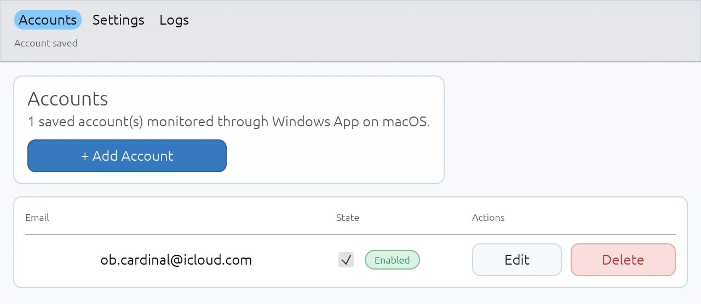

# Windows App AutoLogin



Windows App AutoLogin is a small desktop tray/menu-bar utility for macOS and Windows that fills Microsoft Windows App credential prompts only when the visible prompt clearly belongs to one saved account.

It is designed for the narrow case where Windows App shows a password prompt with a visible email address. The app verifies the running Microsoft client, reads the visible email, matches exactly one enabled account, loads only that account's password, fills the password field, and submits the prompt.

This project is not affiliated with Microsoft.

## What It Does

- Runs as a lightweight tray/menu-bar app by default.
- Opens the full settings window only on demand.
- Stores account metadata in a local config file.
- Stores passwords in the system secure store by default: macOS Keychain on macOS, Windows Credential Manager on Windows.
- Detects Windows App credential prompts.
- Auto-fills password prompts only after a visible email matches exactly one enabled account.
- Handles native secure password fields only inside a verified credential prompt.
- Keeps internal diagnostic logs bounded and redacted.
- Provides a standalone sanitized macOS UI diagnostic tool for development.

## Safety Model

The app is intentionally conservative. It should do nothing unless the current state is unambiguous.

Before loading a password, it requires:

1. Platform automation access for the exact running app: macOS Accessibility, or the current Windows desktop UI Automation session.
2. A trusted Windows App process/window.
3. The expected Microsoft app/process identity.
4. The target app to be frontmost.
5. A visible credential prompt.
6. A visible email address in that prompt.
7. Exactly one enabled saved account matching that email.

Before typing or submitting, it revalidates the target process, PID/window context, prompt contents, visible email, and password field.

Diagnostics use the same trusted target constraints as autofill: supported Microsoft identity, expected install path, signing identity, and verified live PID. App names, process names, and window titles are labels, not sufficient authority for diagnostic traversal.

The app does not:

- preload all saved passwords;
- cache decrypted passwords long-term;
- type when the email is missing, mismatched, duplicated, or ambiguous;
- type into an untrusted or background app;
- use the clipboard for password insertion;
- expose secrets through argv, environment variables, temp files, sockets, or HTTP APIs;
- log passwords, OTPs, tokens, recovery codes, clipboard contents, or raw secure-field values.

## Supported Target App

The runtime trust check currently supports:

- `Windows App`

On Windows, the native implementation uses Windows UI Automation and targets the known Microsoft Windows App process identity.

On macOS, the trusted Microsoft app identity is:

- Bundle ID: `com.microsoft.rdc.macos`
- Microsoft Team ID: `UBF8T346G9`

On macOS, the app expects the Microsoft client bundle to be installed in `/Applications`:

- `/Applications/Windows App.app`

Other app names, copied bundles, unsigned bundles, modified bundles, or unexpected Windows process/path identities are rejected.

## Requirements

- macOS 11 or newer, or Windows 10/11.
- Rust matching the version in `Cargo.toml` (`rust-version = "1.93"`).
- Windows App installed on the same desktop session.
- macOS Accessibility permission for the exact app or binary you launch on macOS.
- macOS may also ask for Automation permission to control System Events; approve it only for the expected Windows App AutoLogin bundle.
- For macOS bundle creation: `sips` and `iconutil`.
- For macOS release packaging: a Developer ID Application signing identity available to `codesign`, plus an `xcrun notarytool` keychain profile.

## Build

Create a production macOS release ZIP with a freshly built, signed, notarized, and stapled app bundle:

```bash
WAAL_RELEASE_BUNDLE_ID=com.example.WindowsAppAutoLogin \
WAAL_MACOS_TEAM_ID=ABCDE12345 \
WAAL_CODESIGN_IDENTITY="Developer ID Application: Example Corp (ABCDE12345)" \
WAAL_NOTARY_PROFILE=windows-app-autologin-release \
script/package_macos.sh --release
```

For a local macOS development bundle, use `./script/build_and_run.sh --verify` instead.

Build-check the Windows implementation from another host when the target is installed:

```bash
cargo check --target x86_64-pc-windows-gnu --all-targets --all-features
```

Build and launch the local macOS development app bundle. This path uses the development bundle identity and ad-hoc signing; it is not a production release build:

```bash
./script/build_and_run.sh --verify
```

The bundle is created at:

```text
dist/WindowsAppAutoLogin.app
```

For a permanent local install, copy the built app to `/Applications` and launch that copy:

```bash
cp -R dist/WindowsAppAutoLogin.app /Applications/
open /Applications/WindowsAppAutoLogin.app
```

macOS grants Accessibility and Keychain access to a specific app identity/path. If you grant access to the app in `dist/` and later move it to `/Applications`, you may need to grant permission again.

## First Run

1. Build and open the app bundle.
2. Use the menu-bar icon and choose **Open Accounts**.
3. If Accessibility is missing, click **Request Accessibility Access** or **Open Accessibility Settings**.
4. Enable Windows App AutoLogin in:

```text
System Settings -> Privacy & Security -> Accessibility
```

5. Return to the app. It checks Accessibility status every second.
6. If macOS prompts for Automation permission to control System Events, approve it for the expected Windows App AutoLogin bundle. The app uses that only for Open at Login cleanup and guarded diagnostics/prompt inspection.
7. Add an account in the **Accounts** tab.
8. Save the email and password.
9. Keep the account enabled.
10. Start the monitor from the menu-bar item if it is not already running.

When the matching Windows App credential prompt is visible and Windows App is frontmost, the background worker attempts one guarded fill and submit sequence.

## Menu-Bar App

The default launch mode is a lightweight supervisor with no always-on egui window. The menu contains:

- **Open Accounts**
- **Open Settings**
- **Start Monitor** / **Stop Monitor**
- **Request Accessibility Access**
- **Open Accessibility Settings**
- Accessibility status
- Password storage status
- Last fill result
- **Quit**

The heavier settings UI is launched only when needed. Closing the settings window returns the app to the lightweight menu-bar process.

## Settings Window

The settings window includes:

- **Accounts**: add, edit, pause, enable, or delete saved accounts.
- **Settings**: adjust Open at Login and storage mode.
- **Diagnose**: only when built with development diagnostics features.

Existing accounts can be edited without re-entering a password. Leave the password field blank to keep the saved password.

Enabled accounts must have:

- a non-empty email;
- a saved password;
- no other enabled account with the same email, ignoring case and surrounding whitespace.

## Configuration

The app stores configuration in the user's macOS config directory, typically:

```text
~/Library/Application Support/WindowsAppAutoLogin/config.json
```

The file contains account metadata and settings only. It does not contain plaintext passwords.

Example:

```json
{
  "accounts": [],
  "settings": {
    "auto_start": false,
    "start_minimized": false,
    "use_keyring": true
  }
}
```

Password records are keyed by account ID and bound to account metadata. Manually editing account IDs or email can disconnect metadata from the saved password and fail closed.

## Password Storage

By default, passwords are stored in the system secure store:

- Service: `WindowsAppAutoLogin`
- Account: the saved account ID

If **Use system secure storage** is disabled, passwords are stored in an encrypted local fallback file:

```text
passwords.json
```

That fallback uses AES-256-GCM. Its encryption key is still stored in the system secure store under:

- Service: `WindowsAppAutoLoginFallbackKey`
- Account: `fallback-encryption-key`

The fallback file is not independent of Keychain or Credential Manager: if the fallback key cannot be created or read from the current user's system secure store, fallback password save/load will fail. On Windows, that key is stored in Credential Manager and protected by user-bound DPAPI. The service name, account ID, purpose, and normalized email hash are validation and routing metadata, not a guarantee that only this executable can decrypt it. Manual metadata edits fail closed.

Recent builds migrate saved passwords when switching storage mode. The app copies and verifies passwords in the new storage before saving the setting, then attempts to remove old copies from the previous backend. If copying or verification fails, the setting is left unchanged. If only old-copy cleanup fails after a save or migration succeeds, passwords remain available in the selected storage and cleanup remains pending for the next launch instead of being forgotten.

During storage-mode and account metadata changes, the app writes a private pending-operation journal so a restart can finish cleanup or restore a consistent config after a crash. Cleanup warnings mean a migration target was verified or an account save completed in the selected backend, but stale old material may remain until recovery succeeds. While that journal exists, stored credential changes are blocked and the app retries cleanup on startup. Manual cleanup targets, if the warning persists, are the old `WindowsAppAutoLogin` account-ID secure-store entries, stale `passwords.json` records, and old fallback key material under `WindowsAppAutoLoginFallbackKey` / `fallback-encryption-key` or legacy `fallback.key`. Do not delete the fallback key while any fallback password records remain.

If Keychain asks for permission repeatedly, make sure you are launching the same app bundle each time and choose **Always Allow** for the intended app identity.

## How Autofill Works

The autofill path is shared by the background worker and the one-shot debug command.

At a high level:

1. Resolve trusted Windows App processes.
2. Verify bundle ID, Team ID, path, and code signature.
3. Require the target app to be frontmost.
4. Detect the visible credential prompt.
5. Collect visible prompt text while excluding secure/password-like fields.
6. Extract the visible email.
7. Match that email against enabled accounts.
8. Revalidate the same frontmost prompt and target process before password load.
9. Load only the matching account password.
10. Detect the intended password field.
11. Focus the field and set the password on that exact AX element with a target-bound `AXValue` update after fresh prompt/focus checks.
12. Submit only with a bounded `AXPress` action on the verified submit button.
13. Post-check whether the app reached an authenticated/normal state, still shows the prompt, or ended in an unknown state.

For password insertion, the app requires a native secure password field: macOS `AXSecureTextField` or Windows UI Automation `IsPassword`. Password-like plain text controls such as macOS `AXTextField` or Windows plain `Edit` are not accepted as insertion targets, even inside a verified Windows App prompt.

## Diagnostics

Run a sanitized macOS UI diagnostic report:

```bash
cargo run --quiet --features diagnostics-ui --bin diagnose-macos-ui
```

The diagnostic binary prints JSON describing visible target processes, windows, controls, and selected system dialogs. Sensitive values are redacted. Raw AppleScript output is not printed.

Diagnostic target discovery uses the same trusted-target constraints as autofill: supported Microsoft identity, expected install path, signing identity, and verified live PID. App names, process names, and window titles are treated only as report labels; they are not enough to select or traverse an arbitrary process.

`release-diagnostics` is reserved for intentional support artifacts, not general releases. Diagnostic output is redacted and capped; signing identities, signing identifiers, Team IDs, and app bundle IDs are reduced to coarse status values before display or export. It can still include process IDs and timing data; review it before sharing with support.

Run one guarded fill attempt from a development build compiled with `debug-fill` or `dev-tools` and launched from the trusted app bundle:

```bash
/Applications/WindowsAppAutoLogin.app/Contents/MacOS/windows-app-autologin --debug-fill-once
```

The one-shot command is intended for development and troubleshooting. It is available only in debug builds with the explicit debug-fill feature enabled and requires Accessibility permission for the trusted `/Applications/WindowsAppAutoLogin.app` bundle identity. Do not package, distribute, or leave a debug-fill build installed as the production app.

## Development Features

Default features:

```text
none
```

Optional features:

```text
debug-fill
diagnostics-ui
dev-tools (enables debug-fill and diagnostics-ui)
release-diagnostics (explicitly permits diagnostics-ui in release support artifacts)
```

Build and launch the full UI with diagnostics enabled:

```bash
./script/build_and_run.sh --dev-ui
```

Launch the packaged app directly into the full settings UI:

```bash
./script/build_and_run.sh --full-ui
```

## Test And Verification

Common local gates:

```bash
cargo fmt --check
cargo check --all-targets
cargo clippy --all-targets -- -D warnings
cargo test
./script/build_and_run.sh --verify
```

Additional feature coverage:

```bash
cargo check --all-targets --all-features
```

The test suite covers the main safety decisions: visible-email matching, missing/mismatched/duplicate accounts, disabled accounts, PID/window drift, settings-generation cancellation, bounded logs, redaction, diagnostic output caps, diagnostics name-spoof rejection, and target identity checks.

## Packaging Notes

`script/build_and_run.sh` creates a local app bundle and ad-hoc signs it when `codesign` is available.

Current development bundle ID:

```text
dev.codex.windows-app-autologin
```

The development script does not perform Developer ID signing or notarization. It opts into `WAAL_DEVELOPMENT_RELEASE=1` only for local non-production release-profile bundles.

Use `script/package_macos.sh --release` only for a publishable macOS zip. The package script builds the release binary from the current checkout in a staging target directory, assembles the `.app`, signs it with `WAAL_CODESIGN_IDENTITY`, notarizes it with `WAAL_NOTARY_PROFILE`, staples the ticket, and then zips only the verified staged bundle. Pre-existing `dist/*.app` bundles are ignored as inputs.

Packaging refuses to continue unless `WAAL_RELEASE_BUNDLE_ID`, `WAAL_MACOS_TEAM_ID`, `WAAL_CODESIGN_IDENTITY`, and `WAAL_NOTARY_PROFILE` are set, the release bundle ID is a reverse-DNS identifier that differs from the development bundle ID, the executable metadata was compiled with the same bundle ID and Team ID, and the bundle passes production trust checks: expected production bundle ID, Developer ID Application signature, matching Team ID, hardened runtime, empty release entitlements, non-diagnostics build metadata, Gatekeeper assessment, and stapled notarization. It removes any stale output ZIP before validation, strips `.DS_Store`, AppleDouble `._*`, and `__MACOSX` entries from the staged copy, then validates the staged bundle and the extracted ZIP artifact before publishing the ZIP.

Use `script/package_macos.sh --release-diagnostics-artifact` only for an intentional support artifact. A release diagnostics artifact is built by the package script with `--features release-diagnostics`, a separate `WAAL_DIAGNOSTICS_BUNDLE_ID`, and the diagnostics app name `WindowsAppAutoLoginDiagnostics.app`; the package script requires both `WAAL_RELEASE_BUNDLE_ID` and `WAAL_DIAGNOSTICS_BUNDLE_ID` and refuses to package if the diagnostics bundle ID matches the production or development bundle ID. `script/build_and_run.sh --dev-ui` is not a release diagnostics path because it builds `dev-tools`, which includes `debug-fill` and is rejected by packaging.

Example release diagnostics packaging command:

```bash
WAAL_RELEASE_BUNDLE_ID=com.example.WindowsAppAutoLogin \
WAAL_DIAGNOSTICS_BUNDLE_ID=com.example.WindowsAppAutoLogin.Diagnostics \
WAAL_MACOS_TEAM_ID=ABCDE12345 \
WAAL_CODESIGN_IDENTITY="Developer ID Application: Example Corp (ABCDE12345)" \
WAAL_NOTARY_PROFILE=windows-app-autologin-release \
script/package_macos.sh --release-diagnostics-artifact
```

The app bundle sets `LSUIElement=true`, so it behaves like a menu-bar utility rather than a Dock-first application.

On macOS, Open at Login is trusted only for the exact canonical bundle path `/Applications/WindowsAppAutoLogin.app` with the expected bundle identifier; the app intentionally refuses autostart from other bundle locations, including transient build locations such as `target/`, `dist/`, `/tmp`, and `/var/folders`. On Windows, Open at Login is trusted only from a protected install folder such as `Program Files`; portable `dist/`, per-user app folders, `target/`, and temporary folders are rejected for Startup registration.

## Troubleshooting

### Autofill does not run

Check:

- The exact launched app has Accessibility permission.
- Windows App is installed in `/Applications`.
- Windows App is frontmost.
- The credential prompt contains a visible email.
- Exactly one enabled saved account matches that email.
- The matching account has a saved password.
- There is no duplicate enabled account with the same email.
- The Microsoft app bundle has not been copied, modified, or re-signed.

### Keychain is slow or prompts every time

Keychain approval time is counted as password load time. If macOS prompts, approve the intended app and choose **Always Allow**.

Repeated prompts usually mean macOS sees a different client identity, for example:

- launching from `target/debug` instead of the `.app`;
- rebuilding an ad-hoc signed bundle repeatedly;
- moving the app after granting permission;
- granting permission to Terminal instead of the bundled app.

### Prompt is visible but password is not typed

The app fails closed if:

- the email is hidden;
- the prompt email does not match an enabled account;
- multiple enabled accounts match;
- the target app is not frontmost;
- the target PID/window changed;
- the platform exposes the password box only as a non-secure plain text field;
- the password field cannot be verified or focused;
- Accessibility returns an error or times out.

### Diagnosis times out

The diagnostic tool uses bounded Accessibility traversal and discards raw output on timeout. A timeout should not expose field values. Try closing unrelated modal dialogs and rerun:

```bash
cargo run --quiet --features diagnostics-ui --bin diagnose-macos-ui
```

## Limitations

- Supports only the Microsoft Windows App identity.
- UI detection depends on macOS Accessibility data on macOS and Windows UI Automation data on Windows.
- Prompts with hidden emails, unusual localization, MFA-only flows, SSO web views, or nonstandard controls may not be fillable.
- The app intentionally prefers doing nothing over guessing.

## License

MIT
